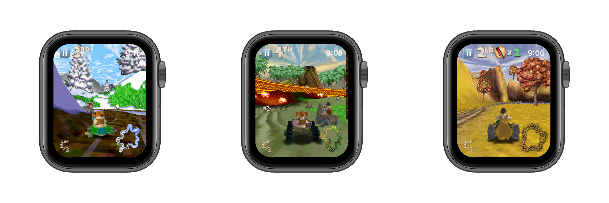

# Cro-Mag Rally for Apple Watch

The Macintosh caveman racing classic from Pangea Software has now been ported to watchOS! This port uses [Iliyas Jorio's modernization](https://github.com/jorio/CroMagRally).

## Performance

Gameplay runs at 30 to 60 FPS on Apple Watch Series 6. The framerate and other debug information can be displayed by removing `#ifndef WATCH` and `#endif` around `InitDebugText();` in OGL_Support.c.

## Known issues

This port is a work in progress. Settings cannot be changed yet, and it has the same graphical issues as the software-rendered [CroMagRally](https://github.com/williehwc/CroMagRally) standalone SDL game, most notably the warped sky box.

## How to play

In the menu screens, turn the crown to select between menu options. Touch the screen to confirm selection. Swipe from left to right to go back.

During gameplay, the vehicle will accelerate automatically. Turn the crown to steer. To let go of the gas, touch and hold on the upper-left quadrant of the screen.

To brake, touch and hold on the lower-left quadrant. Continue to hold to reverse.

To use an item, swipe vertically on the right half of the screen. Most items can be thrown forwards (swipe up) or backwards (swipe down). For other items (e.g., Nitro), swipe either direction to use them.

In the Atlantis course, touch the upper-left quadrant of the screen to ascend, and the lower-left quadrant to descend.

## Build instructions

1. Clone this repository into a folder on your Mac. Recursively clone (`git clone --recursive`) the [CroMagRally](https://github.com/williehwc/CroMagRally) repository into the same folder so they are side-by-side.
2. Follow the macOS instructions for [CroMagRally](https://github.com/williehwc/CroMagRally), steps 1 and 4.
3. Open build/CroMagRally.xcodeproj.
4. Click on the CroMagRally project in the Project Navigator sidebar.
5. Right-click and duplicate the tinygl-static target, and rename the duplicate to tinygl-static-watch.
6. Under the Build Settings tab for tinygl-static-watch, add WATCH to the Preprocessor Macros.
7. For Supported Platforms, select watchOS (you may need to go to the All tab to access this setting).
8. For Architectures, specify arm64_32, armv7k, arm64, and x86_64. The first two architectures are for Apple Watch (newer and older models, respectively), the last two are for the Simulator. Specify them all so you don't have to do this again for this target.
9. At the top of the window (left of >), select the newly created scheme for TinyGL. You can go to Manage Schemes… to rename the scheme if you wish.
10. On the right of >, select the most recent Apple Watch model to build for the Simulator, or "Any watchOS device" to build for an actual Apple Watch, then click Run (the play button). You will have to repeat this step if you change your mind later.
11. Repeat steps 4 to 9 for Pomme. The new target will be Pomme-watch.
12. Close the CroMagRally project window. You cannot have this window and CroMagRallyWatch open simultaneously.
13. Open CroMagRallyWatch.xcodeproj from this repository.
14. Click on the CroMagRallyWatch (not CroMagRally) project in the Project Navigator sidebar.
15. Click on the CroMagRallyWatch WatchKit Extension target (it has an 🅔 icon).
16. In Build Settings, change Other Linker Flags and Header Search Paths to reflect your folder structure.
17. Click Run (the play button); the game should build, install, and run. Intalling to Apple Watch will take time; please be patient.

## Credits

This port uses my custom implementation of TinyGL, forked from [C-Chads/tinygl](https://github.com/C-Chads/tinygl), which is based on the original TinyGL project by Fabrice Bellard. Some additions are based on Zoltan Baldaszti's [proposed changes](https://github.com/C-Chads/tinygl/issues/18).

Thanks to Tomas Vymazal for providing an excellent example of porting a classic game (Quake) to Apple Watch, available [here](https://github.com/MyOwnClone/quake_watch).

The [modernization of Cro-Mag Rally](https://github.com/jorio/CroMagRally) is developed by Iliyas Jorio.

Cro-Mag Rally © 2000 Pangea Software, Inc. Cro-Mag Rally is a trademark of Pangea Software, Inc.